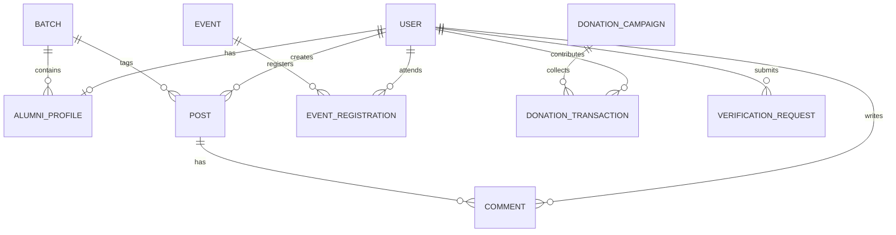

# System Architecture & Technical Specifications

**SSGHS Alumni Association**
(Sabuj Shikshayatan Government High School, Chattogram)
Website: [https://sabujsghs.edu.bd/](https://sabujsghs.edu.bd/)

---

## 🏗️ 1. Architecture Diagram

```
+-------------------------------------------------------------------------+
|                              Client Layer                                |
|   Next.js 15+ App Router (React 19 Server & Client Components)           |
|   Tailwind CSS v4 Design Tokens | Framer Motion | Lucide Icons           |
+--------------------+-------------------------------+--------------------+
                     |                               |
                     v                               v
+--------------------+--------------+   +------------+--------------------+
|            Public Pages           |   |       Authenticated App         |
|  - Landing Page (Hero, Stats, CTA)|   |  - Member Dashboard             |
|  - School Legacy & About Assoc.   |   |  - My Profile (LinkedIn Style)  |
|  - Alumni Directory & Filters     |   |  - Batch Page & Forum           |
|  - Batch Explorer (1985-2025)     |   |  - Community Feed & Comments    |
|  - Events, News, Stories, Gallery |   |  - Direct Messaging & Network   |
|  - Donation Campaigns             |   |  - Admin Verification & CRM     |
+--------------------+--------------+   +------------+--------------------+
                     |                               |
                     +---------------+---------------+
                                     |
                                     v
+------------------------------------+------------------------------------+
|                            API & Data Layer                             |
|  - Next.js Server Actions & Route Handlers                              |
|  - Prisma Client ORM (MongoDB Native Connector)                         |
|  - In-Memory Fallback Repository (Zero-downtime offline capability)     |
+------------------------------------+------------------------------------+
                                     |
                                     v
+------------------------------------+------------------------------------+
|                         MongoDB Database Layer                          |
|  - Database: sshs_alumni                                                |
|  - Collections: Users, AlumniProfiles, Batches, Events, Posts,          |
|    Donations, Gallery, Stories, VerificationRequests                    |
|  - Inspected & Managed via MongoDB Compass                              |
+-------------------------------------------------------------------------+
```

---

## 🏛️ 2. Data Models & Entity Relationships

The schema is built to reflect a multi-generational school ecosystem:



---

## 🎨 3. Design System Tokens & Styling

### Color Hierarchy
- **Brand Forest Primary**: `bg-emerald-950` / `#06281e`, `#0b3d2c`
- **Brand Emerald Vibrant**: `text-emerald-600` / `#059669`, `#10b981`
- **Heritage Warm Gold**: `#d4af37`, `#b8860b`, `#fef3c7`
- **Surface Crisp Light**: `#ffffff`, `#f8fafc`, `#f1f5f9`
- **Border Subtle**: `#e2e8f0`, `#cbd5e1`
- **Typography Base**: Geist Sans / Inter with deep slate readability (`#0f172a`, `#334155`)
